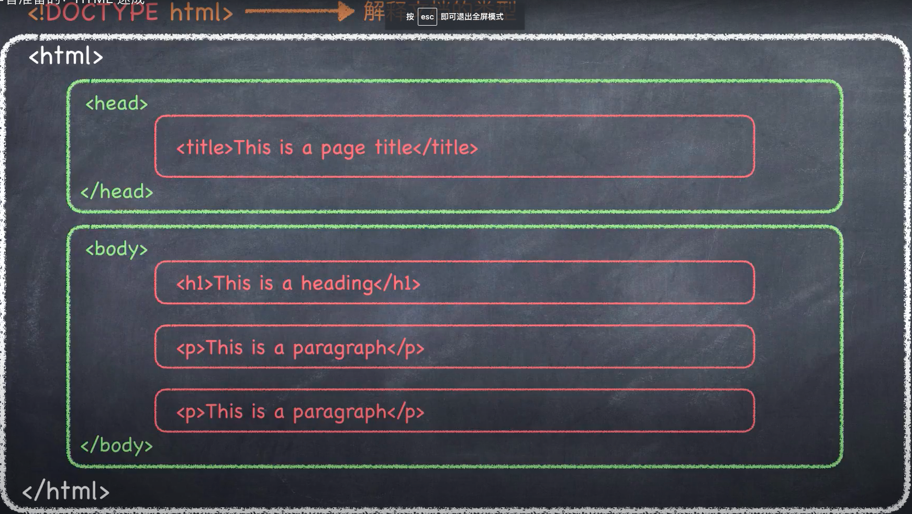
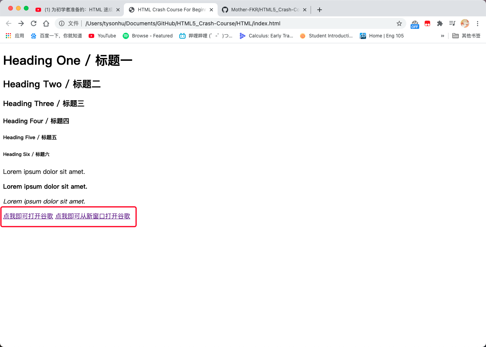

# HTML5 Crash ~~Course~~ Notes / HTML5 速成
一个关于 `HTML5` 的速成笔记📒   （个人记录 / 博客 / Private） 
## 前言  
没错，又是我！我准备开始学习 `HTML5` 和 `CSS3` 啦！什么？你问我为什么刚搞完黑苹果还要学网页前端？这是因为我自己整个了博客但是界面又觉得太丑啦，所以就打算自己学一些关于前端的东西，给自己的博客网页稍微美化“亿”下。是的你没听错！虽然我现在啥都不会从零起步，但我会慢慢学习的！！！所以大🔥🚪就不要笑我啦，我知道你们这些大佬都会就我不会💔 。

咳咳，正经一点，本文章为学习笔记📒 ，并不是什么 `HTML5` 的教程哦。所以也不要指望本文能对你有什么帮助😊 。不过我会按照自己的方式边学边记笔记就是了！至于你愿不愿意看？管你愿不愿意，看就vans啦（海皇附体！）。

我的学习笔记参考这位大佬 `Leonard Chan` 在 `Youtube` 上传的视频 [为初学者准备的：HTML 速成](https://www.youtube.com/watch?v=nNFF_sib0Jc&t=186s),在这里非常感谢这位大佬整理出来的速成教程，感激不尽🙏 。如果你也这么觉得，记个点个订阅！（我这算是打广告嘛？？？）

*这仅仅是我的学习笔记哦，切记不要分享甚至商用！！！（不过我写的这么烂应该没人这么做就是了。。）如果我的学习笔记产生任何版权问题，请即时通知我，我会立刻删除的！*
 
最后，你可能会问为什么学习笔记不放在你的博客上而是在GitHub上？emmm老实说我也又放在博客上，但是这不打算给博客翻新嘛，到时候给文章搬家太麻烦啦，所以就先放这里咯，顺便也给自己做个备份。（手动滑稽）

## 目录
- 开始之前需要的准备

## [1]开始之前的准备
- 浏览器（有其中的一个就行）
  - Google Chrome&nbsp; &nbsp;&nbsp; #大名鼎鼎的恰内存的浏览器（谷歌浏览器）
  - Mozilla Firefox&nbsp; &nbsp; &nbsp; &nbsp; #火狐浏览器
  - Safari&nbsp; &nbsp; &nbsp; &nbsp; &nbsp; &nbsp; &nbsp; &nbsp; &nbsp; &nbsp; &nbsp; &nbsp;#苹果浏览器
  - Edge&nbsp; &nbsp; &nbsp; &nbsp; &nbsp; &nbsp; &nbsp; &nbsp; &nbsp; &nbsp; &nbsp; &nbsp; #微软新推出的浏览器
- 编辑器
  - Visual Studio Code    #推荐，有好看的界面（需装主题，我也用这个写md的，还有实时预览真的好用）
  - Sublime Text &nbsp; &nbsp;&nbsp; &nbsp; &nbsp;  &nbsp; #文本编辑器，也挺全能的，跟上面的VSC差不多就是少了主题和插件
  - Atom &nbsp; &nbsp; &nbsp; &nbsp; &nbsp; &nbsp; &nbsp;&nbsp;  &nbsp; &nbsp; &nbsp; &nbsp;&nbsp;  #一款HTML编辑软件，GitHub亲儿子？
- 即时编辑
  - codepen.io

## [2]什么是HTML？
- **H**yper**T**ext **M**arkup **L**anguage / 超文本**标记语言**
  - 注意⚠️ ：标记语言不做逻辑处理，比如说运算！！！
- `HTML` **并不是**编程语言
- 作用：用于告诉浏览器如何构建网页

### [2-1]HTML结构  
```html
结构解析：
<p> Lorem ipsum dolor sit amet </p>   <!--HTML Element-->
<p>   <!--Opening Tag / 起始标签🏷️-->
</p>  <!--Closing Tag / 结束标签🏷️-->
Lorem ipsum dolor sit amet   <!--Content-->

Tag / 标签:
<p>,,<ul>,<br>,<title>,<section>,<li>,<hr>,<header>,
<span>,<ol>,<tr>,<div>,<input>,<table>,<th>,<footer>,
<article>,<td> 等等
```
更多关于Tag的例子和意义可前往 https://developer.mozilla.org/en-US/docs/Web/HTML/Element 查看。

```html
<!DOCTYPE html> <!--解释文档的类型-->
```


*图片截自上文所提到的视频*

### [2-2]例子
请参考HTML文件夹中的index.html

## [3]Inline and Block Level Element
- 块级元素 / Block Elemet
  - 在页面以（方）块的形式展现
  - **出现新的一行**
  - 占全部宽度
  - Example:
    - ``<div>``,``<h1>`` ~ ``<h6>``,``<p>``
- 内联元素 / Inline Element
  - **通常在块级元素内**
  - **不会导致本文换行**
  - 只占必要的部分宽度
  - Example:
    - ``<a>``,````,``<em>``,``<strong>``

### [3-1]例子
具体请参考HTML文件夹中的index.html
```html
<strong>这是一段加粗的字体</strong>
<em>这是一段斜体的字体</em>
```

## [4]Attribute / 属性
```html
<a href="https://google.com">Lorem</a>
href="https://google.com" <!--attribute-->
<a 添加attribute的位置>xxxx</a>
```
更多关于attribute的信息和定义可前往   
https://developer.mozilla.org/en-US/docs/Web/HTML/Attributes   
或者前往，   
https://developer.mozilla.org/en-US/docs/Web/HTML/Global_attributes    
查看。

### [4-1]例子
具体请参考HTML文件夹中的index.html
```html
<a href="https://google.com">点我即可跳转到谷歌</a> 
<a href="https://google.com" target="_blank">点我即可从新窗口打开谷歌</a>
<!--因为它是Inline Element所以这两个链接是在一行中，他们并不会换行！！！--> 
```
图例：(从图中可以看到它们是在同一行中)


